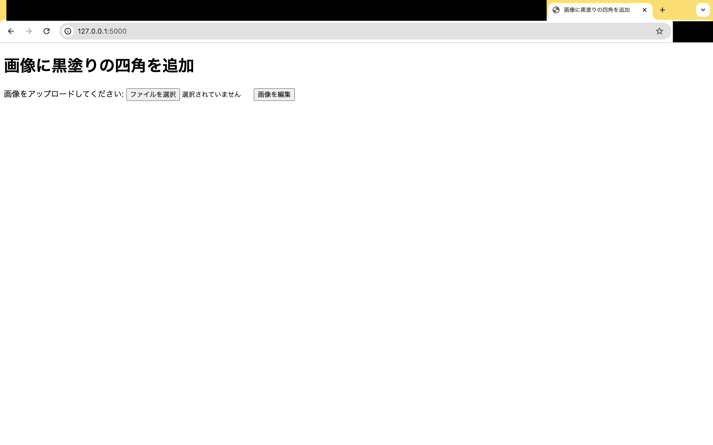
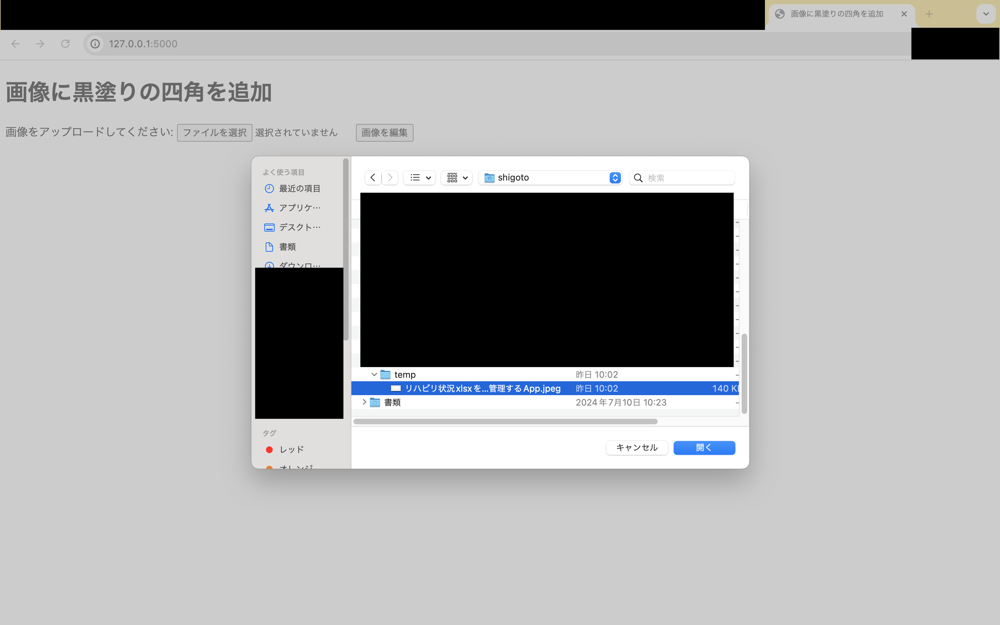
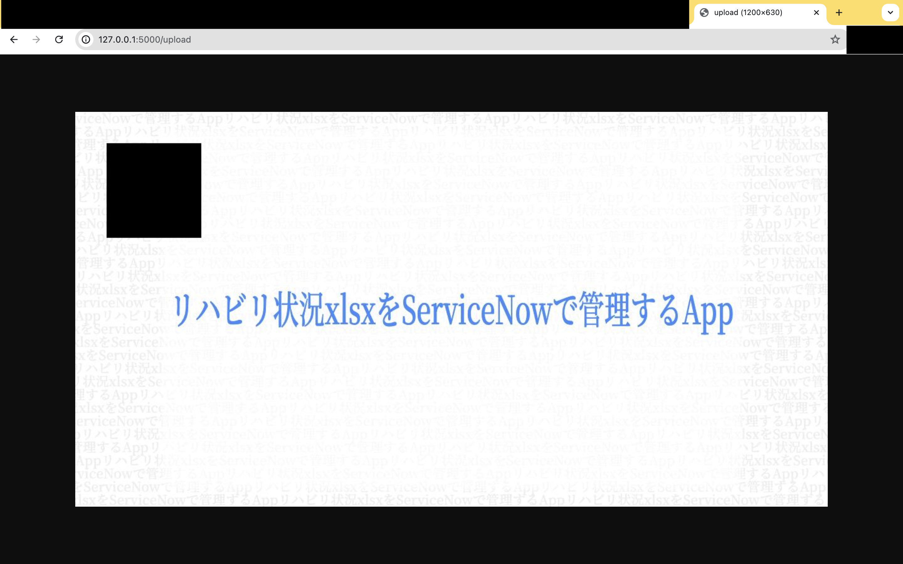

# MosaicPersonalInformation
 画像の個人情報を自動で黒塗りするAPP

 # How　to Use This App
 1. ターミナルでコマンドを実行
 ```zsh
python app.py
 ```
 

 2. 起動を確認したら、ブラウザで、<http://127.0.0.1:5000>にアクセスする
 

 3. ファイルを選択ボタンを押し、自分のフォルダから、モザイクを入れたい画像を選択
 

 4. 「画像を編集」ボタンを押下し、モザイク処理が完了する。
 


 ## アイデア備忘録
 - 黒塗りの枠内に白文字で、「個人情報を自動でモザイク処理しています」といったワードも入れられると良さそう。
